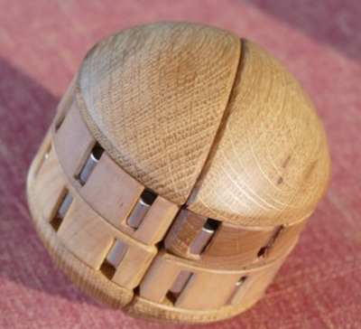
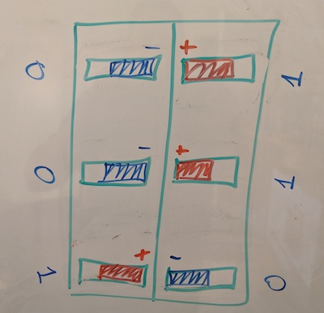
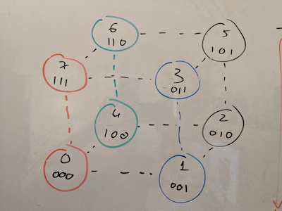

# AuzzlePuzzle
Below are my notes and a quick brute force scanning of the rotating puzzle called Auzzle by Ilya Osipov.



[https://www.facebook.com/AuzzlePuzzle/](https://www.facebook.com/AuzzlePuzzle/)

[https://www.youtube.com/watch?v=c7eOGJ46Mu4](https://www.youtube.com/watch?v=c7eOGJ46Mu4)

Disclaimer: I do not own one. All the work below is my attempt to analyze it after having the pleasure to see and play with a prototype for a few minutes.

## Theory
At first glance the puzzle looks quite overwhelming. It consists of 24 magnets, arranged in pairs, and depending on the polarity of the magnets in the pair, they are either pulled towards the middle, or pushed towards the outer edges. The wooden or plastic pieces holding these magnets can be rotated in multiple directions, constantly changing the matching between the magnets. The puzzle is solved only when all 12 pairs of magnets are pulled towards the middle.

After further inspection, however, it becomes clear that the things are not as bad as they seem. There are actually only 8 unique solid wooden or plastic pieces, each one containing 3 magnets. In other words, only 4 pairs of 2 pieces each. The placement of the magnets within each piece is unique, we can actually represent it as a binary encoding, 1 if the magnets '+' is pointing towards the center, and 0 if '+' points towards the outer edge. Unsurprisingly, 3 bits is the exact number required to encode 8 unique pieces: #0=000, #1=001, #2=010, #3=011, #4=100, #5=101, #6=110, #7=111.

Therefore, each piece has only one and only one matching piece resulting in all 3 pairs of magnets pulling towards the middle.



If we keep thinking in binary, in order for a pair of pieces to be each others matching counterparts, the following condition has to be true:

**A xor reversed(B) == 0**

or in other words, in order to solve the puzzle, piece #0 must be placed against piece #7, #4 against #6, #1 against #3 and #2 against #5.



### Total combinations

Total amount of permutations for 8 unique pieces is 8! = 40,320

We also need to multiply it by 2 to account for two possible states of the outer shell in relation to the internal mechanism.

However if we take any state of the puzzle, whether we rotate it by 180 degrees along X or rotate it in any of the 4 orentations along axis Y, it is still the same state, we don't want to count each state 8 times, so we divide by 8 respectively.

**Total number of combinations: 8! x 2 / 8 = 10,080**

What about possible solutions?

The picture above shows only one possible solution of the puzzle. However it immediately becomes clear that the puzzle has many possible solutions: a) within each pair, the two pieces can swap places; b) the position of the pairs relative to one another can change and the puzzle would still remain solved. 

Permitations to place 2 matching pieces within a pair: 2

We have 4 of these pairs, so total number of permutations is 2^4

Number of ways to place pairs in relation to one another: 4!

Similarly to how we did it before, we multiple by 2 to account for 2 possible states of the outer edge.

And, again, divide by 8 to account for rotation of the whole construction and avoid counting each state as 8 different ones.

**Total number of solutions: 4! x 2^4 x 2 / 8 = 96**

**Observation #1**: It is possible to screw up the assembly of the puzzle and insert magnets in a way that will result in pieces with identical encodings existing within the same puzzle. The number of possible solved combinations will increase, the total number of combinations will decrease. Ouch!

**Observation #2**: In a proper puzzle that actually has 8 uniquely encoded pieces, it is IMPOSSIBLE to get to a state where all the 12 pairs are pushed towards the outer edges. Piece #0 (000) will only push all 3 magnets when paired with another #0, and since there should be only one #0 piece in the puzzle that should never happen. This is true for any encoding that is a 'palyndrome' in a 3bit range (i.e #0, #2, #5, #7) (see [4bit](#4bit) variation for a way to possibly do it with 4 bits)

## Practice

In order to validate my theory and also calculate the **God's Number** (maximum number of moves God has to perform to get to a solved state), I've written a simple simulator that tries to scan all possible states by doing it in reverse, starting with a solved state and traversing the tree of all the possible states. The code can be found in [sim.py](sim.py). It starts at the at the initial solved state shown in the picture above, then performs a BFS'ish scan of the whole space by performing all possible operations. For every state, to avoid double counting rotations (remember the division by 8), it rotates the whole puzzle to a **canonical** state where piece #0 is inside the lower left quadrant. 

```
python sim.py
Total combinations: 10080, Solutions: 96, Max path to solution: 10
Number of paths of length 0: 96
Number of paths of length 1: 192
Number of paths of length 2: 288
Number of paths of length 3: 480
Number of paths of length 4: 768
Number of paths of length 5: 1824
Number of paths of length 6: 2688
Number of paths of length 7: 3264
Number of paths of length 8: 192
Number of paths of length 9: 192
Number of paths of length 10: 96
```
I am sure it can be done much more efficiently, but that was a quick and dirty exercise and it proves my theoretical calulations (the numbers match!). It also reveals the God's Number for Auzzle, that number is 10! 10 moves is all it takes to get from the worst position to one of the 96 solved states.

## Actually solving it

TBD :)

Given the total number of combinations and the total number of solutions, it is actually pretty easy to get to one of the solved states just by fidgeting with the puzzle enough time.

If we mark the matching pieces with 4 different colors like in the picture above, the puzzle is trivial to solve systematically. In fact, we can think of it as a subset of a 2x2x2 cube where one axis rotates only by 180 and another axis doesn't rotate at all. 

However, individual pieces are not marked and the only thing that can be observed externally by looking at the magnets is the result of the interaction between two adjustent pieces (representing **A xor reversed(B)**). This  makes it much more challenging. I would love to get get my hands on one to see if there is a way to properly formulate an algorithm for a solution.

## Variations

### 4bit

In this variant, we have more possible encodings (16) than needed to represent 8 unique pieces, however that allows us to skip encodings that require duplicated pieces:

a) Avoid encodings #0, #6, #9 and #15 (#0 will only fully push away another #0, etc)

b) Avoid encodings #5, #3, #10, #12 (#5 will only fully pull another #5, etc)

That leaves with 8 encodings that do not have any of the issues above, each one of them has a proper counterpart for pulling all 4 of its magnets and and another one of pushing all 4. These encodings are: #1, #2, #4, #7, #8, #11, #13 and #14. And the actual matching pairs for both solutions are as follows:
 
**All magnets pulled inside:** (#1, #7), (#8, #14), (#2, #11), (#4, #13)

**All magnets pushed outside:** (#1, #8), (#2, #4), (#7, #14), (#11, #13)

It would be logical to assume the total amount of combination will not change (the amount of pieces did not change, it is still 8). The amount of solution states should probably double to 192 (96 inside and 96 outside), and the God's number should probably decrease by 1 as well (worst case should probably be only 9 moves away from one of the solved states). To test it, I've duplicated the simulation and modified it to work with the 4bit encodings above, the code can be found (sim-4bit.py)[sim-4bits.py]

Results:
```
python sim-4bits.py
Total combinations: 10080, Solutions: 192, Max path to solution: 9
Number of paths of length 0: 192
Number of paths of length 1: 368
Number of paths of length 2: 512
Number of paths of length 3: 800
Number of paths of length 4: 1184
Number of paths of length 5: 2496
Number of paths of length 6: 2816
Number of paths of length 7: 1616
Number of paths of length 8: 48
Number of paths of length 9: 48
```

Yeap, we guessed right!