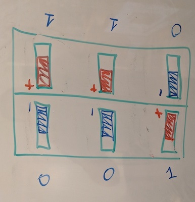

# AuzzlePuzzle
Below is my notes and a quick simulation of the rotating puzzle called Auzzle by Ilya Osipov.


[https://www.facebook.com/AuzzlePuzzle/](https://www.facebook.com/AuzzlePuzzle/)

Disclaimer: I do not even own one. All the work below is my attempt to analyze it after having the pleasure to see and play with a prototype for a few minutes.

## Theory
At a first glance the puzzle looks overwhelming. It has 24 magnets, arranged in pairs, and depending on the polarity of the magnets in the pair, the magnets are either pulled towards the middle, or pushed towards the outer edge. The pieces of the puzzle holding these magnets can be rotated in multiple directions, creating different matches for these pairs. In the solved state, all the 12 pairs are being pulled towards the middle.

After further inspection, however, it becomes clear, that the things are not as bad as they seem. There are actually 8 unique solid pieces, each piece containing 3 magnets. These are the actual pieces that needs to be matched to each other, and the horizontal rotation of the inner pieces is performed by increments of 90 degrees each time. The placement of the magnets within each piece is unique, we can actually represent it as a binary bit, 1 if the magnets '+' is pointing towards the center, and 0 if it points towards the outer edge. And 3 bits is the exact number required to encode 8 unique pieces: 0=000, 1=001, 2=010, 3=011, 4=100, 5=101, 6=110, 7=111.

Therefore, each piece has only one and only one matching piece which will result in all 3 pairs of magents pulling towards the middle.



If we keep thinking in binary, in order for a pair of pieces to be each others matching counterparts, the following has to be true:

**A xor reversed(B) == 0**

or in other words, in order to solve the puzzle, piece #0 must be placed against piece #7, #4 against #6, #1 against #3 and #2 against #5.


**Observation #1**: It is possible to screw up during the assembly of the puzzle and insert magnets in a way that will result in pieces with identical encoding (not 8 unique ones). The number of possible solved combinations will increase, the total number of combinations will decrease.

**Observation #2**: In a properly assembled puzzle that actually has 8 uniquely encided pieces, it is IMPOSSIBLE to get to a state where all the 12 pairs are pushed towards the outer edges. Piece #0 (000) will only push all 3  magnets when paired with another #0, and in a properly assembled puzzle there should be only one of each.

### Total combinations

Total amount of permutations of 8 unique pieces is 8! = 40,320

We also need to multiply it by 2 to account for two possible states of the outer shell (it rotates only on one axis, and it can be either along the X or Z)

However if we take any state of the puzzle, whether we flip it by 180 degrees along X or rotate it in any of the 4 orentations along axis Y, it is still the same combination, so we must divide by 2 and 4 respectively.

**Total number of combinations: 8!*2/2/4 = 10,080**

What about possible solutions?
The picture above shows only one possible solution of the puzzle. However it immediately becomes clear that the puzzle has many possible solutions: within each pair, the two pieces can swap places. Also, the position of the pairs relative to one another can change and the puzzle would still look solved. 

All the permutations of 4 possible pairs: 4!

Each has two positions, and there are 4 pairs, so we multiply 4 times by 2.

Similarly to total combinations, we multiple by 2 to account for 2 states of the outer edge.

And, again, divide by 2 and 4 to avoid double counting of the same combination when we rotate the whole thing together across possible axis.

**Total number of solutions: 4!*2^4*2/2/4 = 96**

## Practice

In order to validate my theory and to also calculate the **God's Number** (maximum number of moves one has to perform to get to a solved state), I've written a simple simulator that tries to scan all possible states by doing it in reverse, starting with a solved state and traversing the tree of all the possible states. The code can be found in [sym.py](sym.py). The code starts at the at the initial solved state shown in the picture above, it performs a BFS'ish scan of the whole space by performing all possible operations. At every stage, however, to avoid double counting rotations, it rotates the whole puzzle to a state where #0 is the lower left quadrant (I call the the **canonical** form). 

```
python sim.py
Total combinations: 10080, Solutions: 96, Max path to solution: 10
Number of pathes of length 0: 96
Number of pathes of length 1: 192
Number of pathes of length 2: 288
Number of pathes of length 3: 480
Number of pathes of length 4: 768
Number of pathes of length 5: 1824
Number of pathes of length 6: 2688
Number of pathes of length 7: 3264
Number of pathes of length 8: 192
Number of pathes of length 9: 192
Number of pathes of length 10: 96
```
I am sure it can be done much more effecicently, but that was a quick and dirty exercise and proves my assumptions (the numbers match!). It also reveals the God's Number for Auzzle, the number is 10! 10 moves is all it takes to get from the worst position to one of the 96 solved states.

## Actually solving it

Given the total number of combinations and the total number of solutions, it is actually pretty easy to get to one of the solved states just by fidgeting with the puzzle enough time.

If we mark the matching pieces with 4 different colors like in the picture above, the puzzle is very easy to solve systematically. In fact we can think of it as a subset of a 2x2x2 cube where one axis rotates only by 180 and another axis doesn't rotate at all. 

However, individual pieces are not marked and the only thing that can be observed externally by looking at the magnets is the result of the interaction between two adjustent pieces (representing **A xor reversed(B)**). This  makes it much more challenging. I would love to get get my hands on one to see if there is a way to properly formulate an algorithm for a solution.

